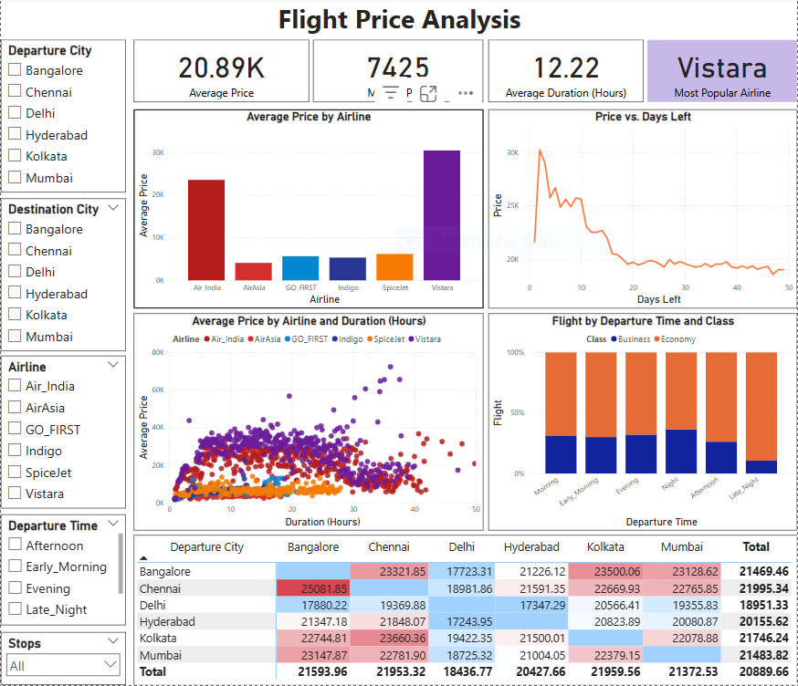

# 📊 Flight Price Analysis Dashboard (Power BI)

This project visualizes flight price data using Power BI with the Flight Price Prediction dataset.

## 🔍 Key Features

- Interactive filters for Departure City, Destination City, Airline, Departure Time, and Stops.
- Sales and Profit trend over time
- Top 10 products and customers
- KPIs: Average Price, Median Price, Average Duration of the Flight (Hours), Most Popular Airline

## 📁 Files

- `flight-price-analysis.pbix`: The Power BI dashboard file
- `Capture.PNG`: Dashboard view

## 📊 Dataset Source

[Flight Price Prediction Dataset on Kaggle]([https://www.kaggle.com/datasets/shubhambathwal/flight-price-prediction])
